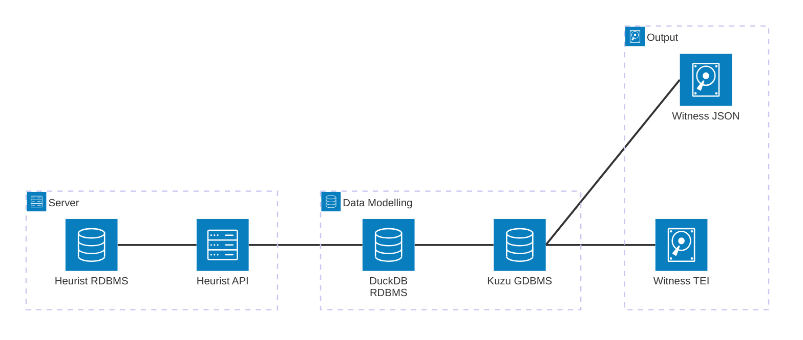

# LostMa Data Pipeline

Data pipeline for the LostMa ERC project, which extracts, transforms, and loads the contents of the Heurist database into local, embedded database files. These local files, having been modelled according to the final, public version of the data, are then used to create artifacts, including JSON and TEI-XML files.

## Table of Contents

- [Architecture](#architecture)
- [Set up](#set-up-)
- [Run](#launch-pipeline-)
    - [Download Heurist data](#1-download-heurist-data)
    - [Model as graph](#2-model-as-graph)
    - [Write witnesses to JSON](#3-write-nested-witness-metadata-to-json)
- [Contributing](./CONTRIBUTING.md)

## Architecture



## Set up 📐

1. Download the code: `git clone https://github.com/LostMa-ERC/data-pipeline.git`

2. Change into the directory: `cd data-pipeline`.

3. Save Heurist login credentials in a `.env` file.

    1. Copy the example [`.env.example`](./.env.example), renaming it `.env`.

    2. Fill in the 2 parameters: `HEURIST_LOGIN`, `HEURIST_PASSWORD`

4. Create and activate a virtual Python environment, version 3.12 or greater.

5. Install the project: `pip install .`

## Launch pipeline 🚀

You can run the full workflow or run steps individually, as long as you make sure to have satisfied each step's prerequesites.

### Full workflow

```shell

```

### Step by step

#### 1. Download Heurist data

- Prerequisites: _None_

- Output:

    - `databases/heurist.duckdb` : [Duckdb](https://duckdb.org/) relational database

```shell
```

#### 2. Model as graph

- Prerequisites:

    - `databases/heurist.duckdb` : [Duckdb](https://duckdb.org/) relational database

- Output:

    - `databases/kuzu_db` : [Kùzu](https://kuzudb.com/) graph database

```shell
```

#### 3. Write nested `Witness` metadata to JSON

- Prerequisites:

    - `databases/kuzu_db` : [Kùzu](https://kuzudb.com/) graph database

- Output:

    - `static/*.json` : 1 JSON file per Witness

        - Witness's metadata
        - Witness's documents
            - Document's parts
            - Document's repository & location

```shell
```
